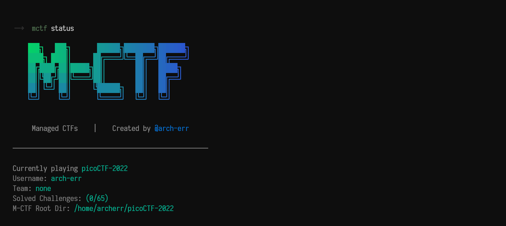

# Manage-CTFs

A tool to manage CTFs on-the-go, to structure your work and document your solutions quickly while playing a CTF.


# Installation


# Usage

## 1. Initialization
```bash
$ mctf init
```
This command will initialize a git repo with metadata, READMEs, challenge-templates, and more.

This action is fully interactive and needs no more flags/switches or other types of given data before execution.


## 2. Solve
```bash
$ mctf solve <challenge> (optional)
```
This command gives you a menu to select a challenge, mark it as finished in the README, and then increment the counter that keeps track of solved challenges.


## 3. Status
To show the status of the current CTF you can run the following command:
```bash
$ mctf status
```
